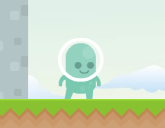

# Free-Runner
This is my first everg game that I have started working on. It is a running game like Super Mario.  I was recently learning Gdevelop and I have started making my own games using this software. This is likely to release by the end of August so stay tuned. 

# Platforms:
I am thinking of releasing this game on all platforms, but for a start this game will release only for platforms below
* Windows
* MacOs
* Linux

# Version
* The first version which will release will be 1.1.0

# Features

 - The game will have a character which will run through the map created.
 - He will collect coins on the way.
 - There are currently no enemies added, but there will be enemies inserted in the future updates of the game.
 - There are 4 lives for the player in the whole game.
 
# Installation:
- > You directly have to install the game. There is an auto-installer for the game.

# Game screenshots

# Gamedev images

# Future Updates

 The future updates will include the following:
* Tough levels
* More maps
* Enemies
* Boss Battle
* Save file system
* Player Rankings

# For any query contact us here:
* Email - kavinsjindal@gmail.com
* website - https://kavinjindal17.wordpress.com/

